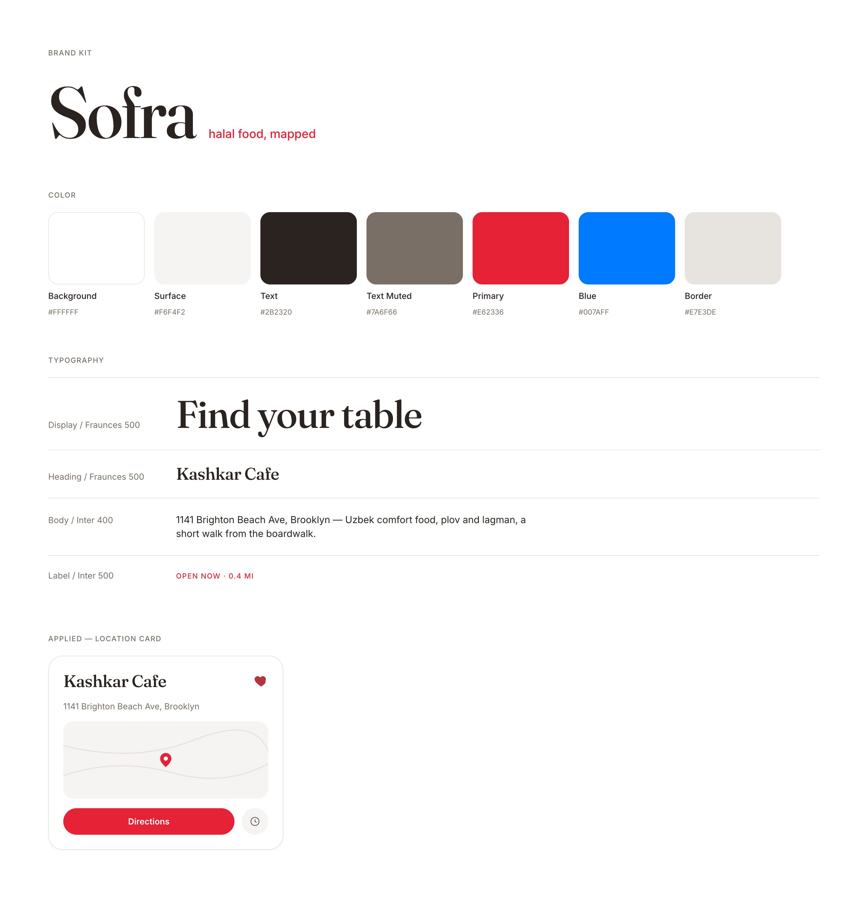

# Sofra Brand Kit

Halal food, mapped. Everything needed to apply the Sofra brand lives in this folder.

## Wordmark

Set in Fraunces, medium weight, tight tracking. Use on the splash screen, marketing site, and any full lockup context. Don't recolor it outside the palette below.

## Icon mark

A bold Fraunces "S," terracotta on white, bled to the edges of the frame rather than centered with heavy padding. This is the source for the App Store icon (see `Sofra/Assets.xcassets/AppIcon.appiconset`). Flat square, no pre-baked corner rounding, no alpha channel, iOS applies its own mask.

## Color

| Token | Hex | Usage |
|---|---|---|
| Background | `#FFFFFF` | Primary background |
| Surface | `#F6F4F2` | Cards, subtle fills |
| Border | `#E7E3DE` | Hairline dividers/borders |
| Text | `#2B2320` | Primary text (warm charcoal, not pure black) |
| Text Muted | `#7A6F66` | Secondary text, addresses, captions |
| Primary | `#C1502E` | Terracotta brand accent, buttons, active states, icon mark |
| Primary Dark | `#9C3F24` | Pressed/dark state of primary |
| Favorite | `#B5323F` | Heart/favorite indicator only, kept distinct from Primary so it doesn't compete with the brand accent |

Deliberately not green. Every other halal-discovery app in this space defaults to green; terracotta is the one thing designed to make Sofra recognizable at a glance in a row of App Store icons.

## Typography

- **Display**: Fraunces, medium/semibold weight. Restaurant names, headers, the wordmark. Warm serif, carries the brand's personality.
- **Body / Label**: Inter, regular/medium weight. Addresses, buttons, captions, anything functional. Neutral and highly legible.

Both are variable fonts (`Fraunces-Variable.ttf`, `Inter-Variable.ttf` in this folder), registered at runtime in the app via `Theme.swift` / `FontRegistrar`, no static weight files needed.

## Where this is wired into the app

`Sofra/Theme.swift` is the single source of truth in code, `SofraTheme` exposes the colors above and `SofraTheme.Typography` exposes the two type roles. Applied in:

- `SplashScreen.swift`: wordmark, background
- `LocationPreview/LocationPreviewView.swift`: map marker tint (primary / favorite)
- `SingleLocationView/SingleLocationView.swift`: restaurant name, address, directions button
- `FavoritesButton.swift`, `FavoritesView.swift`: favorite heart, empty state

If the palette or type scale changes, update `Theme.swift` and this file together so they don't drift.
